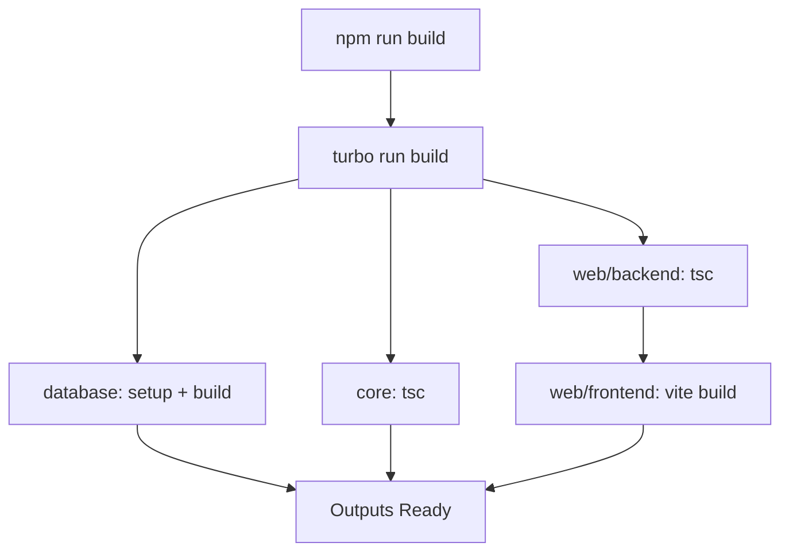

# 🚀 HAXBOTRON V2 - DEPLOYMENT GUIDE

## 📋 REQUISITOS DEL SISTEMA

### **Versiones Requeridas**
- **Node.js**: >= 18.0.0 (Recomendado: 20.x LTS)
- **NPM**: >= 9.0.0 (Especificado: 11.6.2)
- **PM2**: >= 5.4.2 (⚠️ Solo Linux - Se instala automáticamente)
- **Sistema**: Linux/Ubuntu (Producción con PM2) | Windows (Producción directa)

### **Verificar Versiones**
```bash
node --version  # Debe ser >= 18.0.0
npm --version   # Debe ser >= 9.0.0
```

---

## 🏗️ ARQUITECTURA DEL SISTEMA

### **Estructura del Monorepo**
```
haxserver2/             ← raíz del repo (MikuServerPro)
├── database/           # 🗄️ Subsistema de Base de Datos
│   ├── src/           # Código TypeScript
│   ├── dist/          # Código compilado
│   └── prisma/        # Schema y DB SQLite
├── core/              # 🎮 Core Server (Fastify + Haxball)
│   ├── src/           # Código TypeScript
│   └── dist/          # Código compilado → app.js
├── web/
│   ├── backend/       # 🌐 API Backend (Fastify)
│   │   ├── src/       # Código TypeScript
│   │   └── dist/      # Código compilado → server.js
│   └── frontend/      # ⚛️ Dashboard (React + Vite)
│       ├── src/       # Código React
│       └── dist/      # Build estático
├── logs/              # 📝 Logs de PM2
├── ecosystem.config.js # ⚙️ Configuración PM2
└── tsconfig.base.json # 📐 Config TypeScript base
```

### **Procesos en Producción**
- **haxbotron-core**: Puerto 3001 (API Core + Haxball)
- **haxbotron-web**: Puerto 3000 (Dashboard + API Web)

---

## 🔧 SISTEMA DE BUILD

### **Tecnologías de Build**
- **Turborepo**: Orquestación de builds del monorepo
- **TypeScript**: Compilación de todos los workspaces (SIN rootDir restrictivo)
- **Vite**: Build del frontend React
- **PM2**: Process manager para producción

### **Configuración TypeScript Monorepo**
- **tsconfig.base.json**: Configuración compartida con paths del monorepo
- **Sin rootDir**: Permite importaciones entre workspaces
- **Paths configurados**: `@mikuserverpro/database`, `@mikuserverpro/core`, etc.

### **Flujo de Build**


### **Outputs Generados**
- `database/dist/` → Prisma client + DB manager
- `core/dist/app.js` → Servidor principal
- `web/backend/dist/server.js` → API web
- `web/frontend/dist/` → Assets estáticos

---

## 🚀 DEPLOYMENT EN LINUX (PM2)

### **Método 1: Script Automático (Recomendado)**
```bash
# Clonar repositorio
git clone <repo-url> mikuserverpro
cd mikuserverpro

# Ejecutar deployment automático
chmod +x deploy-linux.sh
./deploy-linux.sh
```

### **Método 2: Manual**
```bash
# 1. Instalar dependencias y build
npm run build

# 2. Iniciar con PM2
npm run pm2:start

# 3. Verificar estado
npm run pm2:status
```

### **Método 3: Paso a Paso (Debug)**
```bash
# 1. Limpiar build anterior
npm run clean

# 2. Instalar dependencias
npm install

# 3. Build con Turbo
npm run build

# 4. Verificar outputs
ls -la core/dist/app.js
ls -la web/backend/dist/server.js

# 5. Iniciar PM2
mkdir -p logs
pm2 start ecosystem.config.js
```

---

## 🚀 DEPLOYMENT EN WINDOWS (DIRECTO)

### **Método 1: Script Automático (Recomendado)**
```cmd
REM Clonar repositorio
git clone <repo-url> mikuserverpro
cd mikuserverpro

REM Ejecutar deployment automático
deploy-windows.bat
```

### **Método 2: Manual**
```cmd
REM 1. Instalar dependencias y build
npm run build

REM 2. Iniciar en producción (sin PM2)
npm run start:prod
```

### **Método 3: Paso a Paso (Debug)**
```cmd
REM 1. Limpiar build anterior
npm run clean

REM 2. Instalar dependencias
npm install

REM 3. Build con Turbo
npm run build

REM 4. Verificar outputs
dir core\dist\app.js
dir web\backend\dist\server.js

REM 5. Iniciar servicios
npm run start:prod
```

### **Diferencias vs Linux**
- ❌ **Sin PM2**: Windows usa concurrently para gestionar procesos
- ❌ **Sin auto-restart**: Los procesos no se reinician automáticamente
- ❌ **Logs en consola**: No hay archivos de log estructurados
- ✅ **Mismo código**: Funcionalidad idéntica al deployment Linux
- ✅ **Hot reload**: Disponible en desarrollo con `npm start`

---

## ⚙️ CONFIGURACIÓN PM2 (SOLO LINUX)

### **ecosystem.config.js**
```javascript
module.exports = {
  apps: [
    {
      name: 'haxbotron-core',
      script: './core/dist/app.js',
      env: { NODE_ENV: 'production', PORT: 3001 },
      // Auto-restart, logging, memory limits
    },
    {
      name: 'haxbotron-web', 
      script: './web/backend/dist/server.js',
      env: { NODE_ENV: 'production', PORT: 3000 },
      // Auto-restart, logging, memory limits
    }
  ]
};
```

### **Comandos PM2**
```bash
npm run pm2:start    # Iniciar procesos
npm run pm2:stop     # Detener procesos
npm run pm2:restart  # Reiniciar procesos
npm run pm2:delete   # Eliminar procesos
npm run pm2:logs     # Ver logs en tiempo real
npm run pm2:status   # Estado de procesos
```

---

## 🔍 VERIFICACIÓN DEL DEPLOYMENT

### **1. Verificar Build**
```bash
# Archivos críticos deben existir
ls -la core/dist/app.js           # Core server
ls -la web/backend/dist/server.js # Web API
ls -la web/frontend/dist/index.html # Frontend
ls -la database/dist/index.js     # Database manager
```

### **2. Verificar Procesos**

**Linux (PM2):**
```bash
pm2 status
# Debe mostrar:
# ┌─────────────────┬────┬─────────┬──────┬───────┐
# │ App name        │ id │ status  │ cpu  │ memory│
# ├─────────────────┼────┼─────────┼──────┼───────┤
# │ haxbotron-core  │ 0  │ online  │ 0%   │ 45.2mb│
# │ haxbotron-web   │ 1  │ online  │ 0%   │ 38.1mb│
# │ haxbotron-ui    │ 2  │ online  │ 0%   │ 25.1mb│
# └─────────────────┴────┴─────────┴──────┴───────┘
```

**Windows (Procesos directos):**
```cmd
REM Verificar que los procesos estén corriendo
tasklist | findstr node
REM Debe mostrar múltiples procesos node.exe
```

### **3. Verificar Endpoints**
```bash
# Health checks
curl http://localhost:3001/health  # Core API
curl http://localhost:3000/health  # Web API

# Dashboard
curl http://localhost:3000         # Frontend
```

### **4. Verificar Logs**
```bash
# Logs en tiempo real
npm run pm2:logs

# Logs específicos
tail -f logs/core-combined.log
tail -f logs/web-combined.log
```

---

## 🐛 TROUBLESHOOTING

### **Error: Script not found**
```bash
# Problema: core/dist/app.js no existe
# Solución:
cd core && npm run build
ls -la dist/app.js
```

### **Error: Prisma client not initialized**
```bash
# Problema: Database no configurada
# Solución:
cd database
npm run generate
npm run setup
```

### **Error: Port already in use**

**Linux:**
```bash
# Problema: Puertos 3000/3001 ocupados
# Solución:
npm run pm2:delete  # Detener procesos existentes
lsof -ti:3000 | xargs kill -9  # Matar procesos en puerto
lsof -ti:3001 | xargs kill -9
```

**Windows:**
```cmd
REM Problema: Puertos 3000/3001 ocupados
REM Solución:
netstat -ano | findstr :3000
netstat -ano | findstr :3001
REM Usar el PID para matar el proceso:
taskkill /PID <PID> /F
```

### **Error: rootDir compilation issues**
```bash
# Problema: Files not under rootDir
# Causa: tsconfig.json con rootDir muy restrictivo
# Solución: Los tsconfig.json ya están configurados sin rootDir
# para permitir importaciones del monorepo

# Si persiste:
npm run clean
npm install
npm run build
```

### **Error: Build fails with TypeScript**
```bash
# Problema: Errores de compilación
# Solución:
npm run clean       # Limpiar builds anteriores
rm -rf node_modules # Reinstalar dependencias
npm install
npm run build

# Verificar que no hay rootDir en tsconfig.json
```

---

## 📊 MONITOREO EN PRODUCCIÓN

### **Logs Estructurados (Solo Linux)**
- `logs/core-combined.log` → Logs del core server
- `logs/web-combined.log` → Logs del web backend  
- `logs/ui-combined.log` → Logs del frontend
- `logs/*-error.log` → Solo errores
- `logs/*-out.log` → Solo stdout

### **Métricas por Plataforma**

**Linux (PM2):**
```bash
pm2 monit  # Monitor interactivo
pm2 show haxbotron-core  # Detalles del proceso
npm run pm2:logs  # Logs en tiempo real
```

**Windows (Consola):**
```cmd
REM Los logs aparecen directamente en la consola
REM No hay archivos de log estructurados
REM Usar Ctrl+C para detener todos los procesos
```

### **Health Checks**
- **Core**: `GET /health` → Estado DB + salas activas
- **Web**: `GET /health` → Estado general + proxy

---

## 🔄 ACTUALIZACIONES

### **Deployment de Nuevas Versiones**
```bash
# 1. Detener procesos
npm run pm2:stop

# 2. Actualizar código
git pull origin main

# 3. Rebuild y reiniciar
npm run build
npm run pm2:start
```

### **Rollback Rápido**
```bash
# 1. Volver a commit anterior
git checkout <commit-hash>

# 2. Rebuild y reiniciar
npm run build
npm run pm2:restart
```

---

## 🌐 ACCESO AL SISTEMA

### **URLs de Producción**
- **Dashboard (beta GCE)**: http://&lt;IP-VM&gt;:5173
- **Web API** (interno): http://localhost:3000
- **Core API** (interno): http://localhost:3001
- **Health Core**: `GET http://localhost:3001/health`
- **Health Web**: `GET http://localhost:3000/api/health`

Guía beta VM: **`docs/BETA-GCE.md`**

### **Credenciales por Defecto**
- **Dashboard**: Contraseña `admin123`
- **Super Admin**: Configurar en web interface

---

## 📋 CHECKLIST DE DEPLOYMENT

### **Pre-deployment**
- [ ] Node.js >= 18.0.0 instalado
- [ ] PM2 disponible globalmente
- [ ] Puertos 3000/3001 libres
- [ ] Variables de entorno configuradas

### **Durante Deployment**
- [ ] `npm run build` exitoso
- [ ] `core/dist/app.js` existe
- [ ] `web/backend/dist/server.js` existe
- [ ] PM2 procesos online
- [ ] Health checks responden

### **Post-deployment**
- [ ] Dashboard accesible
- [ ] Logs sin errores críticos
- [ ] Base de datos inicializada
- [ ] Monitoreo configurado

---

## 🚨 COMANDOS DE EMERGENCIA

### **Linux (PM2):**
```bash
# Parar todo inmediatamente
npm run pm2:delete

# Reinicio completo
npm run clean && npm run build && npm run pm2:start

# Ver logs de errores
tail -f logs/*-error.log

# Verificar procesos del sistema
ps aux | grep node
netstat -tulpn | grep :300
```

### **Windows (Directo):**
```cmd
REM Parar todo inmediatamente (Ctrl+C en la consola)
REM O matar procesos por PID:
tasklist | findstr node
taskkill /PID <PID> /F

REM Reinicio completo
npm run clean
npm run build
npm run start:prod

REM Verificar procesos del sistema
tasklist | findstr node
netstat -an | findstr :300
```

---

## ✅ CAMBIOS CRÍTICOS APLICADOS

### **Problema Resuelto: rootDir TypeScript**
- **Antes**: `rootDir: "./src"` impedía importaciones del monorepo
- **Después**: Sin `rootDir` en todos los tsconfig.json
- **Resultado**: Importaciones `@mikuserverpro/*` funcionan correctamente

### **Configuración TypeScript Optimizada**
- **tsconfig.base.json**: Paths centralizados del monorepo
- **Workspaces**: Extienden configuración base sin restricciones
- **Build**: Turborepo maneja dependencias correctamente

**✅ Sistema de deployment robusto y sin errores de compilación**