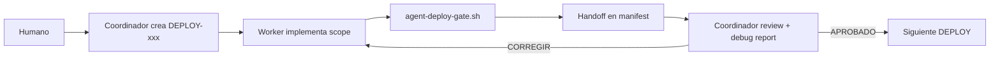

# Agent Deploy — MikuServerPro

Proceso estándar para que **workers** implementen fixes y el **coordinador** revise sin desvíos.

## Roles

| Rol | Quién | Hace |
|-----|-------|------|
| **Humano** | Vos | Prioridad, aprueba deploy VM, pide commits |
| **Coordinador** | Agente router | Manifest, deriva workers, review checklist |
| **Worker** | Agente fix | Código mínimo + build + handoff |

## Artefactos

| Path | Uso |
|------|-----|
| `docs/deploys/_TEMPLATE.md` | Plantilla de cada deploy |
| `docs/deploys/DEPLOY-xxx.md` | Manifest vivo del deploy |
| `docs/deploys/README.md` | Índice de deploys |
| `.cursor/skills/agent-deploy-worker/SKILL.md` | Instrucciones worker |
| `.cursor/skills/agent-deploy-coordinator/SKILL.md` | Instrucciones coordinador |
| `scripts/agent-deploy-gate.sh` | Validación pre-handoff |
| `SystemStatus.md` / `CHANGELOG.md` | Fuente de verdad PROBs |

## Ciclo de un deploy

```mermaid
flowchart TD
  W[Worker: fix + build] --> H{Health OK?}
  H -->|no| REP[GET /api/debug/report]
  H -->|sí| REP
  REP --> A{@SECTION ALERTS}
  A -->|OK + criterios| OK[Coordinador APROBADO]
  A -->|FAIL/WARN| FIX[Coordinador clasifica fix]
  FIX --> SF[small_fix → derivar worker]
  FIX --> RB[rebuild → nuevo scope DEPLOY]
  SF --> W
  RB --> W
```

### Pasos numerados

1. **Worker** implementa manifest → `npm run build` → handoff
2. **Coordinador** verifica stack: `GET /api/health` (web + core)
3. **Coordinador** lee **`GET /api/debug/report`** (o panel `/debug/report`)
   - Buscar `[FAIL]`, `[WARN]`, `@SECTION ALERTS`, `@SECTION LOG_ERRORS`
4. Si **ALERTS ok** y criterios del manifest → **APROBADO**
5. Si no → **loop de fix:**
   - Leer reporte (no logs crudos enteros)
   - Clasificar: **small_fix** (ideal) vs **rebuild** (scope nuevo)
   - Derivar worker con subsistema de `@SECTION FIX_ROUTING`
   - Repetir desde paso 1

Formato del reporte: [`docs/DEBUG-AGENT-REPORT.md`](DEBUG-AGENT-REPORT.md)

## Ciclo clásico (manifest)



## Comandos

```bash
# Worker — después de cambios TS
npm run build

# Worker — antes de handoff
npm run agent-deploy:gate -- DEPLOY-001
```

## Reglas inmutables

1. **Un PROB por worker** (dos max si archivos no se solapan)
2. **GameLoop nunca se rompe** — prioridad sobre stats/bans/UI
3. **Fix mínimo** — ver `.cursor/rules/scope-and-safety.mdc`
4. **Sin commit / sin deploy VM** salvo orden humana
5. **Handoff incompleto = deploy no revisable**

## Índice de deploys

Ver [`docs/deploys/README.md`](deploys/README.md).
