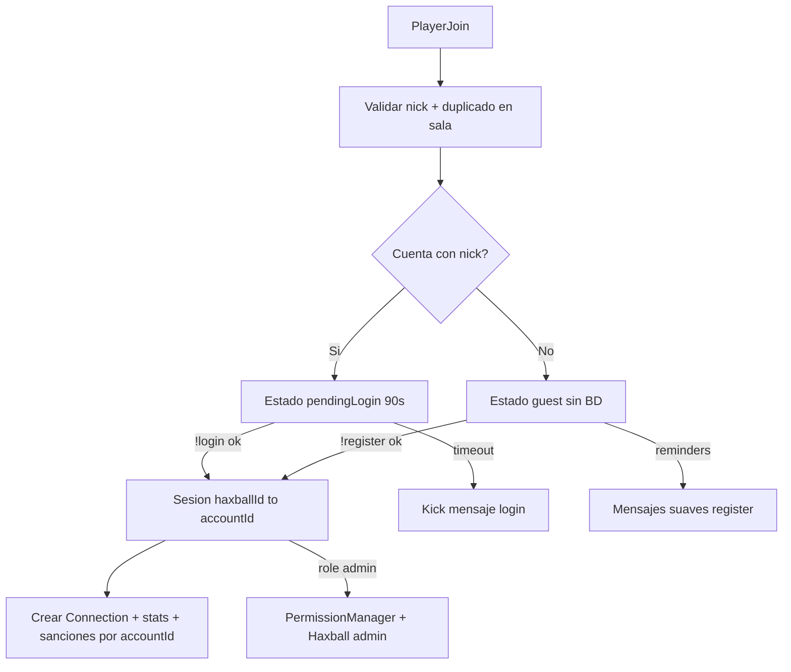

# DEFERIDO — Cuentas de jugador (!register / !login)

**Estado:** no implementar en el servidor público actual.  
**Revisar cuando:** server privado con nicks estables o política clara de identidad.  
**Decisión (2026-06-22):** en Haxball los jugadores cambian mucho el nick; el modelo Minecraft-by-nick es frágil aquí. El análisis completo se conserva abajo para retomarlo más adelante.

**Copia de referencia** del plan Cursor `sistema_cuentas_jugador` — no borrar este archivo al limpiar planes IDE.

---

## Decisión de producto (diseño original)

- **`!register` / `!login`**: cuentas de jugador (nick en sala = username).
- **Admin**: asignado en panel a cuenta registrada; auto-admin al `!login`.
- Reemplazaría `LoginCommand` admin + `AdminPasswords` in-game.

Ver diagrama, schema, fases A–F, riesgos y archivos a tocar en el cuerpo del plan (contenido técnico intacto).

---

## Por qué quedó diferido

1. Nick editable en cliente Haxball — identidad inestable.
2. Contraseñas visibles en chat de sala.
3. Refactor grande (identidad, permisos, stats, panel) con riesgo alto para el objetivo actual: **jugar partido tras partido en sala pública**.

## Prioridad actual del proyecto

Seguir sprints en [`SystemStatus.md`](../../SystemStatus.md): PROB-001, 003, 007 (Sprint 1), luego panel/datos (Sprint 2).

---

<!-- Plan técnico completo conservado a continuación -->

# Plan crítico: cuentas de jugador (!register / !login)

## Decisión de producto (confirmada en diseño)

- **`!register` / `!login`**: solo cuentas de jugador (nick actual en sala = username de la cuenta).
- **Admin**: se asigna en la interfaz a una **cuenta registrada** (`role: admin | superadmin`); al hacer `!login` esa cuenta recibe permisos + admin nativo Haxball automáticamente.
- **Eliminar** el flujo actual de `LoginCommand.ts` + contraseñas `AdminPassword` in-game.

## Cómo lo implementaría (arquitectura)

### Modelo de datos (resumen)

- `PlayerAccount` (nickname unique, passwordHash, role, registeredIp)
- `PlayerAccountIp` (límite cuentas por IP)
- Config `accountAuth` en ServerImage JSON
- Identidad persistente solo post-login; guests sin BD

### Fases A–F

| Fase | Contenido |
|------|-----------|
| A | Schema + AccountService |
| B | SessionManager + join flow + PROB-001 |
| C | !register / !login + permisos por cuenta |
| D | Stats/balance/sanciones solo logueados |
| E | Panel cuentas + deprecar AdminPasswords |
| F | Smoke test |

## Veredicto crítico (del análisis original)

Encaja con salas tipo Minecraft pero **en Haxball es más frágil** (nick editable, chat público). Requiere feature flag, nick único, y posible wipe de datos legacy. Estimación: refactor grande (2–4 semanas), no un sprint chico.

Para el diseño completo (tablas, desventajas numeradas, lista de archivos), ver historial del plan en Cursor o expandir este doc cuando se retome.
